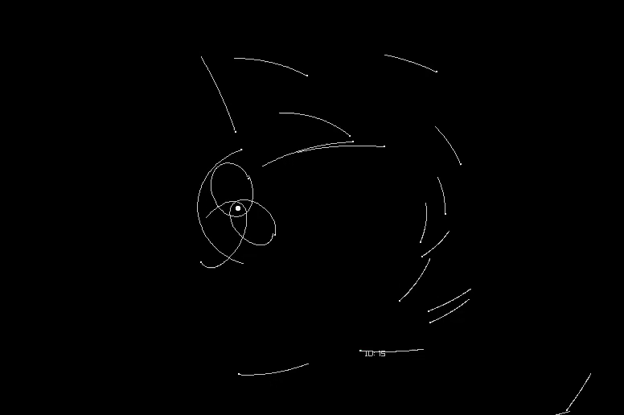

# Brute force Method of Gravity

  

  

 https://en.wikipedia.org/wiki/Newton%27s_law_of_universal_gravitation 
Largest term in O notation: n ^ 2
At 2000 planets the sim is able to achieve 30fps
At 4000 planets the sim is able to achieve 10fps
The scaling is non-linear but its far faster than python was able to achieve
# Barnes-Hut

 https://en.wikipedia.org/wiki/Barnes%E2%80%93Hut_simulation 

Largest term in O notation: n log n

This project is my 3rd iteration on the concept of a solar simulation and my 2nd iteration on a Barnes-Hut.

While I've already done this project before, this has already proven to have it's own unique challenges.

## CMAKE

CMAKE is a newer concept for me, having used C++ in the past primarily for single file programs I thought it finally time to learn a header/package management system like CMAKE or MAKE.

I chose CMAKE because it functions at a higher level of abstraction than traditional make and allows for better cross-platform support. The C in CMAKE stands for cross-platform.
